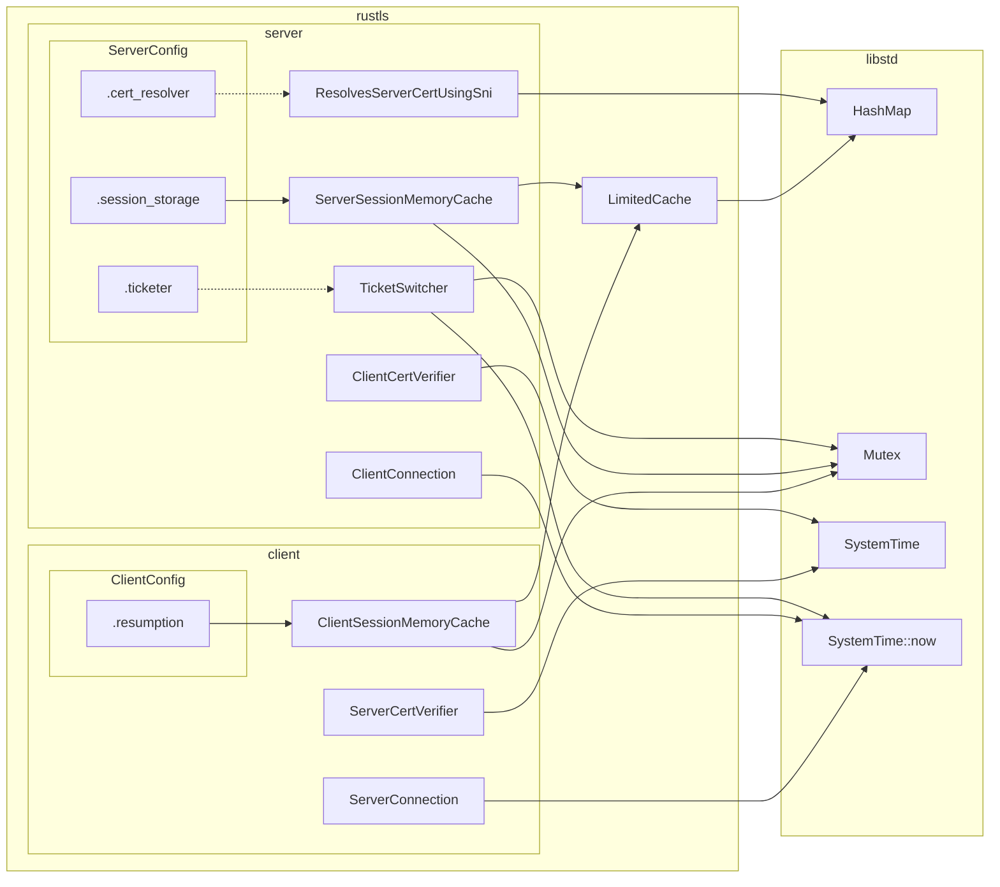
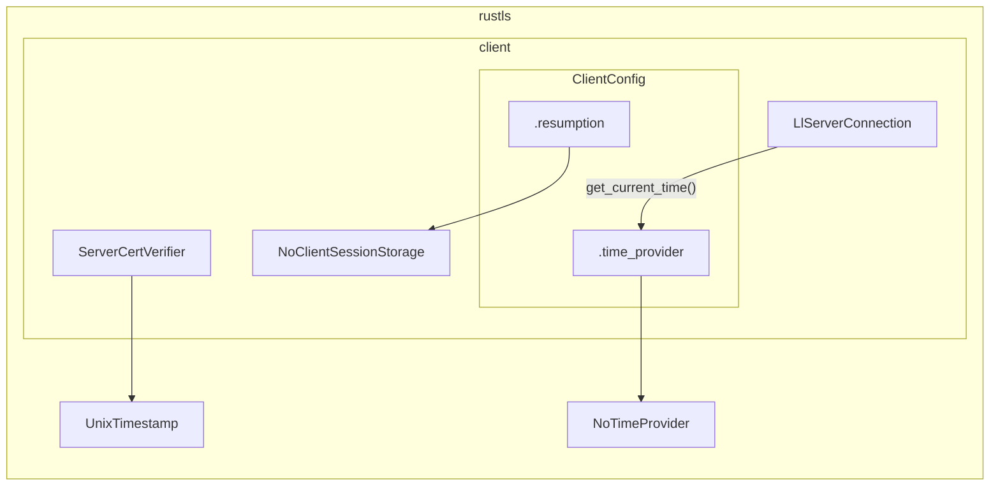
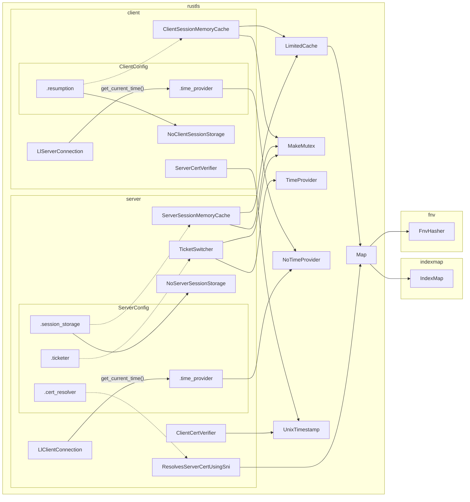

# Summary

Add an opt-out "std" Cargo feature to rustls.

no-std support is to be implemented in two stages:

In the first stage, disabling the "std" feature reduces the rustls API to just client-side functionality.
Importantly, client session support (`ClientSessionMemoryCache`) will be left out in this stage.

In the second stage, the API surface of the no-std mode will be extended to include the client session feature and server-side functionality.

The no-std mode will make use of the `alloc` crate;
that is, no "alloc" Cargo feature is to be added as part of this proposal.

# Motivation / Background

There are many systems, mainly embedded systems or to use a buzzword: "IoT devices", that run, or could run, Rust software without relying on the standard library.
These systems are can roughly divided in two groups: "bare metal" (or "no OS") systems and RTOS (Real Time Operating Systems)-powered systems.

The systems in the first group are usually resource constrained (RAM in the order of hundreds of KB to a few dozens of MB) and ship with a minimal feature set:
a command-line shell will often be non-existent and if a filesystem is deemed too complex as a form of permanent storage for the application then it will also be left out.
These systems do networking by linking to a network stack library that directly interacts with the hardware.
An example of such a library in the Rust ecosystem is [`smoltcp`](https://crates.io/crates/smoltcp).

The systems in the second group do run an Operating System and have networking functionality provided by the OS.
Some RTOS provide a POSIX compatibility layer in some form of "libc" (C library) but not all them do and this makes porting the Rust standard library to these OSes difficult.
That's the main reason why these RTOSes lack libstd support and perhaps why some of them will never get full libstd support.

In order to bring a memory safe TLS implementation to these systems and further the adoption of Rust in the IoT space,
this document lays out a plan for adding no-std support to rustls.

# Uses of libstd API in rustls

rustls (v0.22.0-alpha.3) uses the following libstd API:

- `io::Read` and `io::Write`
- `std::time::SystemTime`
- `std::sync::Mutex`
- `std::net::IpAddr`
- `std::error::Error`
- `std::collections::HashMap`
- `std::collections::HashSet`
- `std::{env, fs, path}`

`io::Read` and `io::Write` appear as trait bounds in the `ConnectionCommon` API.

`ClientConnection` and `ServerConnection` both internally call `UnixTime::now()`, which internally calls `SystemTime::now`, prior to verifying the client / server certificate.

`UnixTime::now` is also used in the following places:

- on the client-side by `ServerConnection` to handle session tickets.
- on the server-side by `ClientConnection` to emit session tickets.
- on the server-side by `TicketSwitcher`

`std::sync::Mutex` is used on the client-side in `ClientSessionMemoryCache` which is the default `Resumption` strategy.
`Mutex` is also used on the server-side in `ServerSessionMemoryCache` which is default session storage and in `TicketSwitcher` which is the recommended `Ticketer`.

`std::net::IpAddr` is used in the `IpAddress` variant of the `ServerName` enum.

The `std::error::Error` trait appears as a trait object (`Arc<dyn Error + Send + Sync>`) in the `Other` variant of both `CertRevocationListError` and `CertificateError`.

`std::collections::HashMap` is used to implement `LimitedCache` which is used on the client-side in `ClientSessionMemoryCache` and on the server-side in `ServerSessionMemoryCache`.
It's also used in `ResolvesServerCertUsingSni` which is one of the available `ResolvesServerCert` implementations that a server can use.

`std::collections::HashSet` is internally used to create TLS records like `ClientHello`.
See the `rustls/src/msgs/handshake.rs` file.

The modules `std::{env, fs, path}` are used to implement the `KeyLogFile` feature.

# State of no-std support in dependencies

Furthermore, these are direct and indirect dependencies that impact the no-std support story:

- `ring`
- `rustls-pemfile`

`ring` does not support common bare metal platforms like ARM Cortex-M (the `thumbv*m-none-eabi*` compilation targets).

Bare metal systems will often lack a filesystem and are likely to store pre-parsed certificates in some form of permanent storage (e.g. Flash).
Firmware on these systems can directly use API like `RootCertStore::add`.

On the other hand, RTOS-powered systems will likely store certificates as `.pem` files.
Software on these systems will want use the `rustls_pemfile` library to parse those files.
`rustls_pemfile` currently does not have no-std support.

# Detailed proposal

## First stage

The goal of the first stage is to enable client functionality without support for sessions in no-std programs.

An opt-out "std" Cargo feature will be added to `rustls`.
When the "std" feature is disabled, rustls is said to be in "no-std mode".
The effects of no-std mode on the API are described in the following sections.

### `LlClientConnection`

The lower-level `ClientConnection` API proposed in [RFC1420] does not rely on the `io::{Read, Write}` traits.
This new API -- from now on, referred to as `LlClientConnection` -- instead of the existing one (as of v0.21.6), will be exposed in no-std mode.

[RFC1420]: https://github.com/rustls/rustls/pull/1420

### `SystemTime::now`

The client internally calls `SystemTime::now` prior to invoking `verify_server_cert`.
In no-std mode, `ClientConfig` will gain a public `TimeProvider` setting.

```rust
#[derive(Clone)]
#[cfg(not(feature = "std"))]
pub struct TimeProvider {
   inner: Arc<dyn GetCurrentTime>,
}

#[cfg(not(feature = "std"))]
pub trait GetCurrentTime {
    fn get_current_time(&self) -> Result<pki_types::UnixTime, ()>;
}

#[derive(Clone)]
pub struct ClientConfig {
    // ..
    #[cfg(not(feature = "std"))]
    pub time_provider: TimeProvider,
}
```

The default `TimeProvider` will always produce an error;
the end user must provide a working implementation when configuring the client.

```rust
#[cfg(not(feature = "std"))]
mod no_std {
    // ..

    impl TimeProvider {
        pub fn new(time_getter: impl GetCurrentTime + 'static) -> Self {
            Self {
                inner: Arc::new(time_getter),
            }
        }
    }

    impl Default for TimeProvider {
        fn default() -> Self {
            Self::new(NoTimeProvider)
        }
    }

    struct NoTimeProvider;

    impl GetCurrentTime for NoTimeProvider {
        fn get_current_time(&self) -> Result<UnixTime, ()> {
            Err(())
        }
    }
}
```

Finally, in no-std mode `LlClientConnection` will get the current time using the configured `TimeProvider`.

```rust
let error = Error::FailedToGetCurrentTime;

#[cfg(feature = "std")]
let now: UnixTimestamp = std::time::SystemTime::now().try_into().map_err(|_| error)?;

#[cfg(not(feature = "std"))]
let now = self.config.time_provider.inner.get_current_time().map_err(|_| error)?;

let cert_verified = self
    .config
    .verifier
    .verify_server_cert(
        // ..
        now,
    )
    // ..
```

Other places that need to be changed are:

- [`client/tls12.rs`](https://github.com/rustls/rustls/blob/1a939124e8b8a72f21bdb557b8d80dc6eef72522/rustls/src/client/tls12.rs#L713) (2 instances)
- [`client/tls13.rs`](https://github.com/rustls/rustls/blob/1a939124e8b8a72f21bdb557b8d80dc6eef72522/rustls/src/client/tls13.rs#L677) (2 instances)
- [`client/hs.rs`](https://github.com/rustls/rustls/blob/1a939124e8b8a72f21bdb557b8d80dc6eef72522/rustls/src/client/hs.rs#L67)

### `std::sync::Mutex`

Disabling the session feature at compile time removes the dependency on the `std::sync::Mutex` API.

In no-std mode, the default `Resumption` strategy will be `Resumption::disabled`.

```rust
impl Default for Resumption {
    fn default() -> Self {
        #[cfg(feature = "std")]
        Self::in_memory_sessions(256)

        #[cfg(not(feature = "std"))]
        Self::disabled()
    }
}
```

`Resumption::in_memory_sessions` and `ClientSessionMemoryCache` will only be available when the "std" feature is enabled.

```rust
impl Resumption {
    #[cfg(feature = "std")]
    pub fn in_memory_sessions(num: usize) -> Self { /* .. */ }
}

#[cfg(feature = "std")]
pub struct ClientSessionMemoryCache {
    servers: Mutex</* .. */>,
}
```

### `std::net::IpAddr`

This `IpAddr` API is also available in `core` but it's unstable API.
The `rustls-webpki` crate includes a no-std compatible `IpAddr` API that can be used in `ServerName`.

The `ServerName` enum will gain a variant that wraps a `wekpki::IpAddress`.
The existing `IpAddress` variant will not be available in no-std mode.
Because `ServerName` is a `#[non_exhaustive]` enum, this is _not_ a breaking change.

```rust
#[derive(Clone, Eq, Hash, PartialEq)]
pub enum ServerName {
    DnsName(DnsName),

    #[cfg(feature = "std")]
    IpAddress(std::net::IpAddr),

    /// Like the `IpAddress` variant but no-std compatible
    NoStdIpAddress(webpki::IpAddress), // <-
}
```

And its `TryFrom<&str>` implementation will be put behind the "std" feature.

```rust
#[cfg(feature = "std")]
impl TryFrom<&str> for ServerName { /* .. */ }
```

When `core::net::IpAddr` gets stabilized, `ServerName::NoStdIpAddress` can be deprecated and
`ServerName::IpAddress` can be switched to use `core::net::IpAddr` and be made available in no-std mode.

```rust
#[derive(Clone, Eq, Hash, PartialEq)]
pub enum ServerName {
    DnsName(DnsName),

    IpAddress(core::net::IpAddr), // <-

    #[deprecated = "use ServerName::IpAddress"]
    NoStdIpAddress(webpki::IpAddress),
}
```

Eventually, the `NoStdIpAddress` variant can be removed and
the `TryFrom` implementation can also be made available in no-std mode.
This change would be a **breaking change** but it's more of a cleanup and not required to complete stage 1.

### `std::error::Error`

`rustls::Error`'s `std::error::Error` implementation will be put behind the "std" feature.

```rust
#[cfg(feature = "std")]
impl StdError for Error {}
```

The `Other` variants of the `CertRevocationListError` and `CertificateError` enum will lose their "cause" field in no-std mode.

```rust
pub enum CertificateError {
    // ..

    #[cfg(feature = "std")]
    Other(Arc<dyn StdError + Send + Sync>),

    #[cfg(not(feature = "std"))]
    Other,
}

pub enum CertRevocationListError {
    // ..

    #[cfg(feature = "std")]
    Other(Arc<dyn StdError + Send + Sync>),

    #[cfg(not(feature = "std"))]
    Other,
}
```

### `ring`

["RFC001 Alternative crypto backends"][rfc001] addresses the platform support limitations of `ring`.
It'll make possible to, for example, use a battle tested crypto C library, like [Mbed crypto][mbed-crypto] or [nrf_oberon], with rustls on ARM Cortex-M platforms.

[rfc001]: https://github.com/rustls/rustls/pull/1184
[mbed-crypto]: https://os.mbed.com/docs/mbed-os/v6.16/apis/mbed-crypto.html
[nrf_oberon]: https://developer.nordicsemi.com/nRF_Connect_SDK/doc/latest/nrfxlib/crypto/doc/nrf_oberon.html

### `rustls_pemfile`

All the existing parsing API in `rustls_pemfile` (v1.0.3) operates on `BufRead` traits objects.

`rustls_pemfile` will gain an opt-out "std" Cargo feature.
When the feature is disabled, all the API that depends on `BufRead` will be removed.

```rust
#[cfg(feature = "std")]
pub fn read_one(rd: &mut dyn io::BufRead) -> Result<Option<Item>, io::Error> {
    // ..
}
```

A new parsing API that operates on a slice will also be added.

```rust
pub mod slice {
    #[non_exhaustive]
    pub enum Error {
        IllegalSectionStart,
        SectionEndMissing,
        Decode(base64::DecodeError)
    }

    pub fn read_all(bytes: &[u8]) -> Result<Vec<Item>>, Error> {
        // ..
    }
}
```

When the "std" feature is disabled, the "std" feature of `base64` will be disabled but its alloc feature will remain enabled.

```toml
[features]
std = ["base64/std"]

[dependencies]
base64 = { version = "0.21", default-features = false, features = ["alloc"] }
```

## Second stage

The goal of the second stage to add client-side session support and server functionality to the no-std mode.

The non-breaking changes required in this stage are described in the following sections.

### `LlServerConnection`

The server side version of `LlClientConnection`, the `LlServerConnection` API, will be exposed in no-std mode.
See [RFC1420] for details about this API.

### Mutex provider

There's no good no-std replacement for `std::sync::Mutex` because a mutex implementation needs to be aware of the preemption strategy that the software will use.

For example, a spinlock-based mutex like the one provide in the `spin` crate can be used in no-std context.
However, that kind of mutex can deadlock when used from an interrupt / signal handler.
Firmware running on bare metal systems will often use interrupts for power savings reasons;
if rustls were to internally use a spinlock-based mutex that could result in a hard to debug deadlock in those systems.
RTOSes will often provide a mutex abstraction designed to work with their thread / task model and
that will certainly be a more performant solution than a spinlock-based mutex.

no-std mode will let the end user select the mutex solution that rustls will use.
To that end, the following API will be added:

```rust
pub trait Lock: Send + Sync {
    type Data: Send;

    fn lock(&self) -> Box<dyn ops::DerefMut<Target = Self::Data> + '_>;
}

pub trait MakeMutex {
    fn make_mutex<T>(value: T) -> Arc<dyn Lock<Data = T>>
    where
        T: Send + 'static;
}
```

An implementation of these traits may look like this:

```rust
use rtos::Mutex;

impl<T: Send> Lock for Mutex<T> {
    type Data = T;

    fn lock(&self) -> Box<dyn ops::DerefMut<Target = Self::Data> + '_> {
        Box::new(self.lock().unwrap())
    }
}

struct RtosMutexProvider;

impl MakeMutex for MutexProvider {
    fn make_mutex<T>(value: T) -> Arc<dyn Lock<Data = T>>
    where
        T: Send + 'static,
    {
        Arc::new(Mutex::new(value))
    }
}
```

In no-std mode, structs that store a mutex will switch from `std::sync::Mutex` to `Arc<dyn Lock>` and their constructors will gain a generic type parameter with a trait bound on `MakeMutex`.
An example of the changes is shown below for `ServerSessionMemoryCache`:

```rust
pub struct ServerSessionMemoryCache {
    #[cfg(feature = "std")]
    cache: Mutex<LimitedCache<Vec<u8>, Vec<u8>>>,

    #[cfg(not(feature = "std"))]
    cache: Arc<dyn Lock<Data = LimitedCache<Vec<u8>, Vec<u8>>>>,
}

impl ServerSessionMemoryCache {
    #[cfg(feature = "std")]
    pub fn new(size: usize) -> Arc<Self> {
        Arc::new(Self {
            cache: Mutex::new(limited_cache::LimitedCache::new(size)),
        })
    }

    #[cfg(not(feature = "std"))]
    pub fn new<M: MakeMutex>(size: usize) -> Arc<Self> {
        Arc::new(Self {
            cache: M::make_mutex(LimitedCache::new(size)),
        })
    }
}
```

Other API that will be affected:

- `TicketSwitcher::new`
- `Ticketer::new`
- `ClientSessionMemoryCache::new`

### `ClientSessionMemoryCache`

The modified (see previous section) `ClientSessionMemoryCache` will become available in no-std mode.

### Default `StoreServerSessions`

The `session_storage` setting in `ServerConfig` defaults to `ServerSessionMemoryCache` but that requires a mutex implementation.

In no-std mode, the default `session_storage` setting will be set to `NoServerSessionStorage`

```rust
impl<C: CryptoProvider> ConfigBuilder<ServerConfig<C>, WantsServerCert<C>> {
    // ..

    pub fn with_cert_resolver(self, cert_resolver: Arc<dyn ResolvesServerCert>) -> ServerConfig<C> {
        ServerConfig {
            #[cfg(feature = "std")]
            session_storage: handy::ServerSessionMemoryCache::new(256),

            #[cfg(not(feature = "std"))]
            session_storage: Arc::new(handy::NoServerSessionStorage {}),
            // ..
        }
    }
}
```

### `ServerConfig.time_provider`

The server configuration will gain a `TimeProvider` setting just like the client configuration did.

This `TimeProvider` setting will be used to get the current time in the following places:

- [`server/tls12.rs`](https://github.com/rustls/rustls/blob/1a939124e8b8a72f21bdb557b8d80dc6eef72522/rustls/src/server/tls12.rs#L543) (3 instances)
- [`server/tls13.rs`](https://github.com/rustls/rustls/blob/1a939124e8b8a72f21bdb557b8d80dc6eef72522/rustls/src/server/tls13.rs#L313) (3 instances)

### `TicketSwitcher`

This private API needs to fetch the current time during its operation.
In no-std mode, its constructor will include a `TimeProvider` argument.

```rust

pub struct TicketSwitcher {
    #[cfg(not(feature = "std"))]
    time_provider: TimeProvider,
}

impl TicketSwitcher {
    pub fn new(
        lifetime: u32,
        generator: fn() -> Result<Box<dyn ProducesTickets>, rand::GetRandomFailed>,
        time_provider: TimeProvider,
    ) -> Result<Self, Error> {
        // ..
    }
    // ..
}
```

This argument will bubble up to public the `Ticketer::new` constructor.

```rust

impl Ticketer {
    #[cfg(feature = "std")]
    pub fn new() -> Result<Arc<dyn ProducesTickets>, Error> {
        // ..
    }

    #[cfg(not(feature = "std"))]
    pub fn new(time_provider: TimeProvider) -> Result<Arc<dyn ProducesTickets>, Error> {
        // ..
    }
}
```

### Alternatives to `HashMap` / `HashSet`

There are two no-std alternatives to `std::collections::HashMap`:

- `std::collections::BTreeMap`
- [`IndexMap`][indexmap] plus a no-std hasher like [`FnvHasher`][fnv]

[indexmap]: https://crates.io/crates/indexmap
[fnv]: https://crates.io/crates/fnv

The second alternative is implemented as follows:

```rust
use fnv::FnvHasher;
use indexmap::IndexMap;

type FnvHashMap<K, V> = IndexMap<K, V, FnvHasher>;

fn new<K, V>() -> IndexMap<K, V, FnvHasher> {
    IndexMap::with_hasher(<_>::default())
}
```

These alternatives have [different "big O" performance characteristics][map-perf],
with `IndexMap` being closest in performance to `HashMap`.
On the flip side, using `BTreeMap` does not require adding new dependencies.

[map-perf]: https://doc.rust-lang.org/1.71.0/std/collections/index.html#maps

As the use of `HashMap` is not user-facing, this proposal defers the actual decision to the implementation phase where,
for example, benchmark data can provide a clearer picture of the trade-offs between the two alternatives on a case-by-case basis.

## API not available in no-std mode

Aside from the API mentioned in the two "stage" sections the rest of the API will require the "std" feature to be enabled.
The API to be left out of no-std mode is listed below: (non-exhaustive list)

- `ClientConnection`
- `KeyLogFile`
- `Reader`
- `ServerConnection`
- `Stream`
- `Writer`

# Alternatives

## Alternative Lock API

An alternative `Lock` API that removes the need for a boxed trait object on each `lock` call is shown below:

```rust
pub trait Lock: Send + Sync {
    type Data: Send;

    fn lock(&self, f: impl FnOnce(&mut Self::Data));
}
```

Note that the closure argument of the `lock` method does _not_ return a value because that would make the `lock` method generic and render the trait _not_ object safe, meaning that e.g. `Arc<dyn Lock<Data = Thing>>` can no longer be constructed.

As the closure cannot return a value, as a workaround, it would have to set a captured option to the value it wants to return.
Given how `std::sync::Mutex` is used today that's perhaps not much of an issue as show below.

```rust
impl client::ClientSessionStore for ClientSessionMemoryCache {
    fn kx_hint(&self, server_name: &ServerName) -> Option<NamedGroup> {
        let mut ret = None;

        self.servers.lock(|servers| {
            ret = servers.get(server_name).and_then(|sd| sd.kx_hint);
        });

        ret
    }
    // ..
}
```

## Trait object cause in `*Error::Other`

The main proposal removes the cause field from `CertRevocationListError::Other` and `CertificateError::Other`.
An alternative is to preserve the cause as `Arc<dyn fmt::Debug + Send + Sync>`.

```rust
pub enum CertRevocationListError {
    Other(Arc<dyn fmt::Debug + Send + Sync>),
    // ..
}
```

This works with the `#[derive(Debug, Clone)]` attribute that both errors use.

# Other designs that were considered

## `Guard` associated type in `Lock`

Something like this:

```rust
trait Lock {
    type Data;
    type Guard: ops::DerefMut<Target = Self::Data>;
    fn lock(&self) -> Self::Guard;
}
```

This is not a good option for two reasons:

In a concrete trait object all the associated types must be concrete types and appear in the trait object type.
This means that rustls data structures would have to store a `Lock` trait object of the form `Arc<dyn Lock<Data = rustls::Type, Guard = third_party::MutexGuard>>`.
This creates a direct dependency between rustls and the crate where the mutex guard type is defined but the goal of using a `Lock` trait is to eliminate that dependency so this design fails to meet the goal.

Due to the lack of GAT (Generic Associated Types) support on stable it's not possible to tie the lifetime of `lock`'s `self` parameter to `Self::Guard`.
Workarounds include having `lock` take `self` by value and implementing `Lock` on `&'a MutexGuard` as shown below:

```rust
trait Lock {
    type Data;
    type Guard: ops::DerefMut<Target = Self::Data>;
    fn lock(self) -> Self::Guard;
    //      ^^^^
}

impl<'a, T> Lock for &'a Mutex<T> {
//   ^^               ^^
    type Data = T;
    type Guard = MutexGuard<'a, T>;
    fn lock(self) -> Self::Guard {
        // ..
    }
}
```

but this (having a method that takes `self` by value) makes the trait not object safe.

The other workaround is adding a lifetime type parameter to the trait

```rust
trait Lock<'a> {
//         ^^
    type Data;
    type Guard: ops::DerefMut<Target = Self::Data>;
    fn lock(&'a self) -> Self::Guard;
    //       ^^
}

impl<'a, T: 'a> Lock<'a> for RtosMutex<T> {
    type Data = T;
    type Guard = RtosMutexGuard<'a, T>;
    fn lock(&'a self) -> Self::Guard {
        // ..
    }
}
```

but this then clashes with how `MakeMutex` is meant to work:

```rust
trait MakeMutex {
    fn make_mutex<T>(value: T) -> Arc<dyn Lock<'static, Data = T, Guard = RtosMutexGuard<'static, T>>>
    where
        T: Send + 'static;
}
```

because during normal operation a `Mutex` won't produce a `MutexGuard` with a static lifetime.

## A `Lock::lock` that returns a `Result`

`Lock::lock` does not return a `Result` like `std::sync::Mutex::lock` does.

Returning a `Result` requires either:
adding an associated `Error` type to `Lock` which brings the first problem described in the previous section;
or using a boxed trait object in the error type parameter of `Result`.

There's no equivalent to the `std::error::Error` trait in no-std so `Box<dyn fmt::Debug>` could have been used instead.
However, given that all internal uses of `std::sync::Mutex` immediately `unwrap` the result returned by `Result`, it didn't seem worth the hassle to box an error that it's going to immediately be `unwrap`-ed.

# Appendix

## FAQ

> why no-std support depends on the `alloc` crate?

For a few reasons:

rustls uses `Arc`-ed dynamic trait objects (e.g. [`Resumption`](https://github.com/rustls/rustls/blob/384dd1c3fa9b725fdfb55bd168951e31900f7144/rustls/src/client/client_conn.rs#L281-L284)) to avoid adding type parameters and trait bounds to its public API;
Removing those allocations / trait objects would require semver-breaking changes in several parts of the public API and likely negatively impact the ease of use of the library.
This proposal requires no semver breaking changes and does not affect the ergonomics of the library.

rustls also allocates in other places in its implementation that might be possible to remove without affecting the public API but removing those allocations would still be a significant undertaking.
This proposal takes the "least resistance" path towards no-std support.

## Diagrams

This section contains some `mermaid` diagrams that show the relationship between rustls components and libstd API today and how those change as different stages of this proposal are implemented.
Note that libstd API dependencies that were deemed less relevant are not shown in these diagrams;
for example, `std::error::Error` is not shown.

### "Today" (v0.21.6)



### Stage 1



### Stage 2


