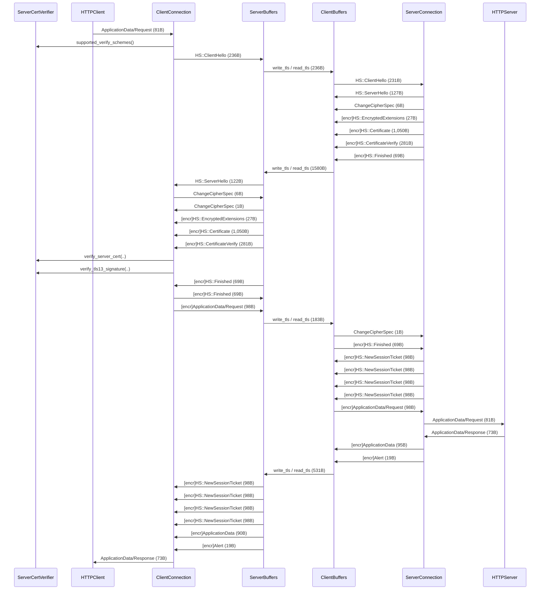

# `sketch`

This is a mock implementation of the the API described in the 'caller-managed buffers' RFC.

The crate includes a few unit tests that you can run locally with:

```console
$ cargo t -- --nocapture client

$ cargo t -- --nocapture server
```

The unit tests print logs that match [logs collected from running][logs-branch] the `tlsclient-mio` and `tlsserver-mio` examples in the rustls (v0.21.6) repository.

[logs-branch]: https://github.com/japaric/rustls/tree/logs/examples

In addition to the unit tests, a re-implementation of the `rustls::Stream` on top of the proposed `LlConnection` API is included in the `stream.rs` file.
This re-implementation does not include tests.

## Sequence diagrams

### TLS 1.3

The unit tests replicate this exchange between `tlsclient-mio` and `tlsserver-mio`.
The numbers of bytes in the unit tests logs and this sequence diagram may not match exactly.


