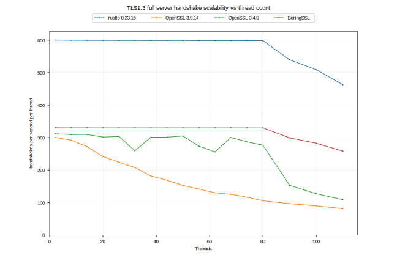
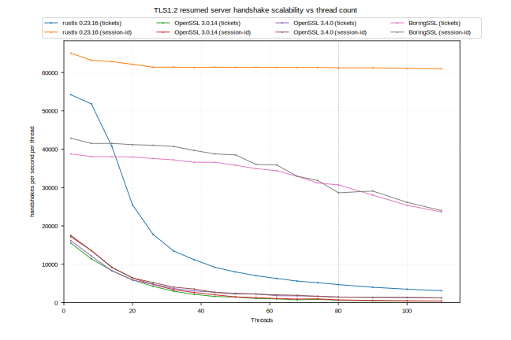
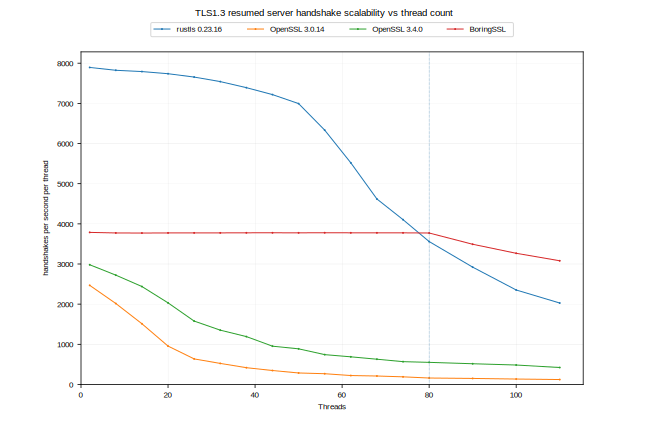
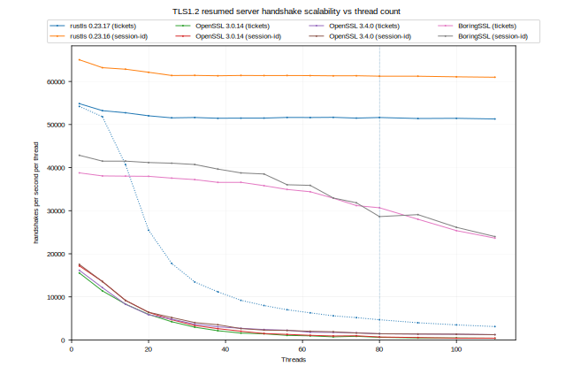
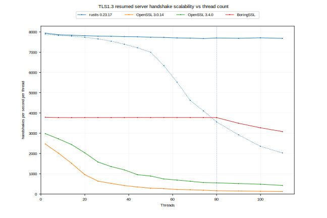
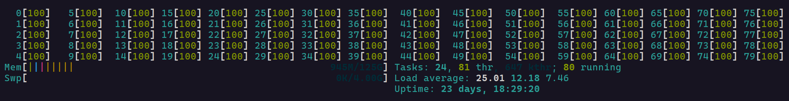
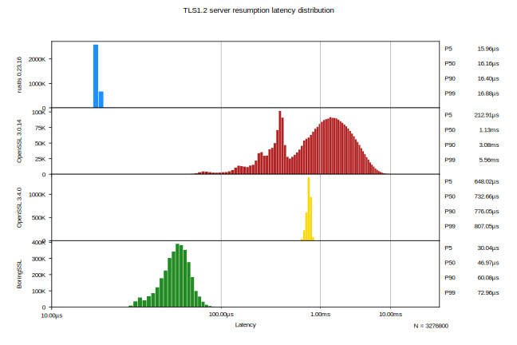
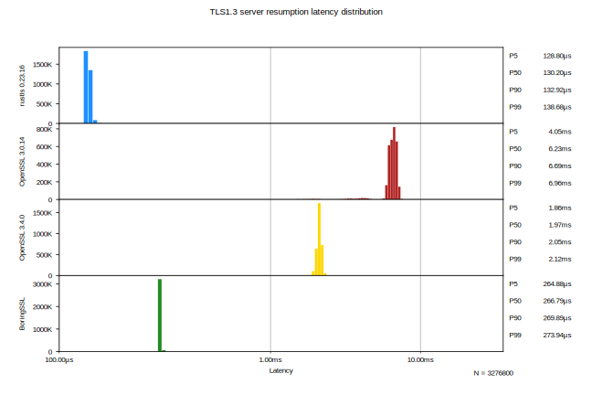
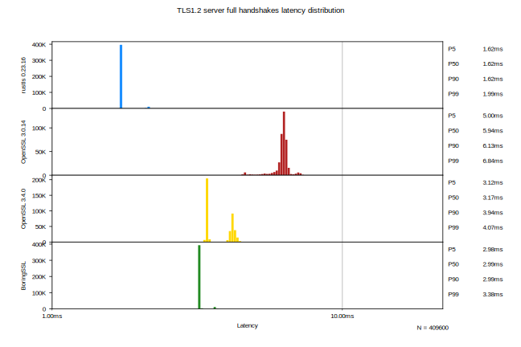
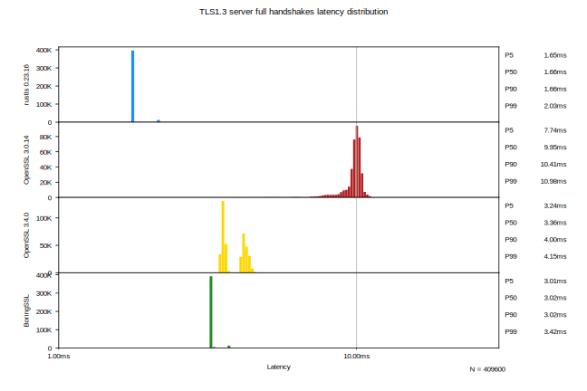

+++
title = "Measuring and Improving rustls's Multithreaded Performance"
date = 2024-11-28
+++

### System configuration

We ran the benchmarks on a bare-metal server with the following characteristics:

- OS: Debian 12 (Bookworm).
- C/C++ toolchains: GCC 12.2.0 and Clang 14.0.6.
- CPU: Ampere Altra Q80-30, 80 cores.
- Memory: 128GB.
- All cores set to `performance` CPU frequency governor.

This is the [Hetzner RX170](https://www.hetzner.com/dedicated-rootserver/matrix-rx/).

### How the benchmarks work
Compared to [previous reports](/perf), the benchmark tool can now perform the same
benchmarks in many threads simultaneously.  Each thread runs the same benchmarking
operation as before, and threads do not contend with each other _except_ via
the internals of the TLS library.

As before, the benchmarking is performed by measuring a TLS client "connecting" to
a TLS server over a memory buffer -- there is no network latency, system calls, or
other overhead that would be present in a typical networked application.
This arrangement actually should be the worst case for multithreaded testing: every
thread should be working all the time (rather than waiting for IO) and therefore
contention on any locks in the library under test should be maximal.

### Versions
The benchmarking tool used for both OpenSSL and BoringSSL was [openssl-bench `02249496`](https://github.com/ctz/openssl-bench/tree/02249496d2963e2a0b694e7be3b37f0d85f8eccd).

#### BoringSSL and OpenSSL
The version of BoringSSL and its build instructions are the same
as [the previous report](@/perf/2024-10-18-report.md).

We test OpenSSL 3.4.0 which is the latest release at the time of writing.

We also include measurements using OpenSSL 3.0.14, as packaged by Debian
as 3.0.14-1~deb12u2.  This is included to observe the thread scalability improvements
made between OpenSSL 3.0 and 3.4.

#### Rustls
The tested version of rustls was 0.23.16, which was the latest release when this work
was started.  This was used with aws-lc-rs 1.10.0 / aws-lc-sys 0.22.0.

Additionally the following three commits were included, which affect the benchmark tool but do not affect the core crate:

- [a5d510ea](https://github.com/rustls/rustls/commit/a5d510ea4e5a44611f49985bbaba84b6c4f51533)
- [44522ad0](https://github.com/rustls/rustls/commit/44522ad089add58bc7df54ec9903528ab6d5f64f)
- [d1c33f86](https://github.com/rustls/rustls/commit/d1c33f8641c1c69edc27d98047c38f7f852f55eb)

### Measurements

BoringSSL was tested with this command:

```shell
~/bench/openssl-bench
$ BENCH_MULTIPLIER=2 setarch -R make threads BORINGSSL=1
```

OpenSSL 3.4.0 was tested with this command:

```shell
~/bench/openssl-bench
$ BENCH_MULTIPLIER=2 setarch -R make threads
```

OpenSSL 3.0.14 was tested with this command:

```shell
~/bench/openssl-bench
$ BENCH_MULTIPLIER=2 setarch -R make threads HOST_OPENSSL=1
```

rustls was tested with this command:

```shell
~/bench/rustls
$ BENCH_MULTIPLIER=2 setarch -R make -f admin/bench-measure.mk threads
```

## Initial results

Since we now have three dimensions of measurement (implementation,
thread count, test case), this is restricted to some selected test cases.

We concentrate on server performance, as servers seem more likely to
be run at large concurrencies.

The graphs below are handshakes per second _per thread_.  The ideal
and expected shape should be a flat, horizontal line up to 80 threads,
with a fall-off after that.  A flat line means doubling the number of
threads doubles the throughput; a declining line would mean less than
that, and indicates additional threads reduce the per-thread performance.

### Full TLS1.3 handshakes on the server

This case is a common one for a TLS server, and excludes
any need for state on the server side.



This graph shows the OpenSSL 3 scalability problems, the improvements
made between OpenSSL 3.0 and 3.4, and the absence of such problems
in BoringSSL and rustls.

### Resumed TLS1.2 handshakes on the server

This covers both ticket-based resumption, and session-id-based resumption.
The latter requires the server to maintain a cache across threads, so some
"droop" is expected in these traces.



Clearly something is not right with rustls's ticket resumption performance.

### Resumed TLS1.3 handshakes on the server

This covers only ticket-based resumption, so the server needs no state between
threads.



Again, rustls's ticket resumption performance is suspect.

# Improving rustls's ticket resumption performance

In rustls we have a `TicketSwitcher`, which is responsible for rotating
between ticket keys periodically.  This is important because (especially
in TLS1.2) compromise of the ticket key destroys the security of all past
and future sessions.

Unfortunately, a mutex was held around all ticket operations -- so that
a thread finding the key need to be rotated did not race another thread
currently using that key.

In [PR #2193](https://github.com/rustls/rustls/pull/2193) this was improved
to use a rwlock -- this means there is no contention at all in the common case.

The improvement was released in [rustls 0.23.17](https://github.com/rustls/rustls/releases/tag/v%2F0.23.17)
and looks like:





# Measuring worst-case latency at high concurrency

The above measurements only record _average handshake throughput per thread_,
which is fine for seeing how that changes with the number of threads.
Another important measure is: what is the latency distribution of all handshakes
performed, at high thread counts?  What we're looking for here is evidence
that no one handshake experiences poor performance.

From here on, the version of rustls tested moved to [`fc6b4a19`](https://github.com/rustls/rustls/commit/fc6b4a193b065604d10e16e79d601d8a30c18492) (which is shortly after the 0.23.18 release)
to add support for outputting individual handshake latencies in the benchmark tool.

In the following test, we measure handshake latency when 80 threads are working
at once.  In the rustls test, this produces very satisfying `htop` output:



Note that the below charts use a base 10 logarithm x axis, to adequately show the
four distributions in one figure.



Here we can clearly see an improvement between OpenSSL 3.0 and OpenSSL 3.4.
rustls has the tightest distribution, followed by BoringSSL.  (OpenSSL 3.4's distribution
may appear visually tighter than BoringSSL's, however the scale is logarithmic, so it is not.)







The remainder show the same theme:  rustls has a tight distribution, followed
by BoringSSL, followed by OpenSSL 3.4.  OpenSSL 3.0 has the widest distribution.
