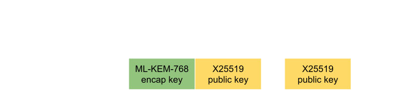
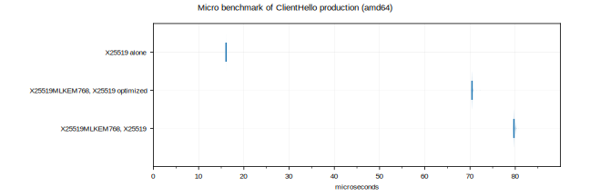
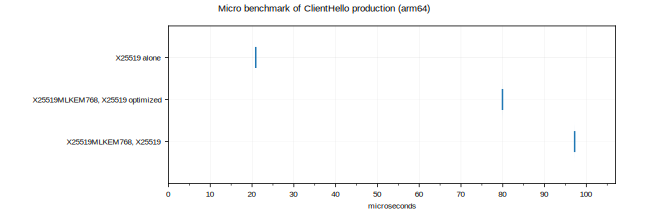
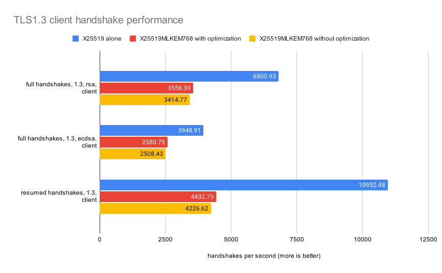
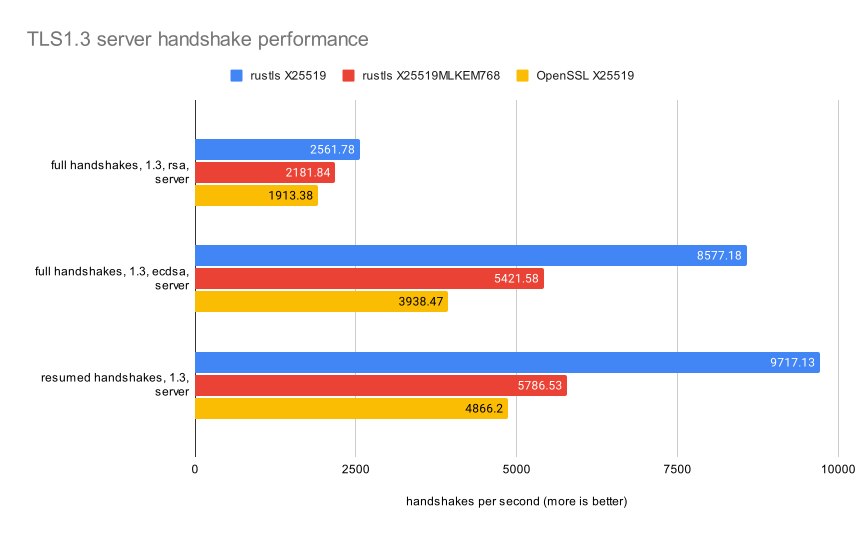

+++
title = "Improving Post-Quantum Handshake Performance"
date = 2024-12-12
+++

## Background

In TLS1.3, the client starts the key exchange in its first message (the `ClientHello`).
The `ClientHello` includes both a description of which algorithms the client supports, and
zero or more presumptive "key shares".

The server then evaluates which algorithms it is willing to use, and either uses one
of the presumptive key shares, or replies with a `HelloRetryRequest` which instructs
the client to send new `ClientHello` with a specific, mutually-acceptable key share.

A `HelloRetryRequest` can be expensive, because it introduces an additional round trip
into the handshake.  It also means any work the client did for its presumptive key
shares is wasted.

It's therefore advantageous for a client to avoid `HelloRetryRequest`s, such as by:

- **Having prior knowledge of the server's preferences.**  [draft-ietf-tls-key-share-prediction]
  is an effort to standardize a mechanism for a client to learn this out-of-band.

- **Remember a server's preferences from a previous connection.**  rustls has
  done this since adding support for TLS1.3 in 2017.  This generally means
  a client making many connections to one server may avoid repeated `HelloRetryRequest`s.

- **Sending many presumptive key shares.** Though there's an obvious trade-off
  in terms of wasted computation and message size.

- **Following ecosystem preferences.** [X25519] key exchange is overwhelmingly
  preferred in TLS1.3 implementations, due to its performance and implementation
  quality.

[draft-ietf-tls-key-share-prediction]: https://datatracker.ietf.org/doc/draft-ietf-tls-key-share-prediction/
[X25519]: https://datatracker.ietf.org/doc/html/rfc7748
[ML-KEM]: https://csrc.nist.gov/pubs/fips/203/final
[X25519MLKEM768]: https://datatracker.ietf.org/doc/draft-kwiatkowski-tls-ecdhe-mlkem/02/

## Post-quantum key exchange

To defend against the potential advent of "Cryptographically Relevant Quantum Computers"
there is a move to using "hybrid" key exchange algorithms.  These glue together
a classical algorithm (like X25519) and a post-quantum-secure algorithm (like [ML-KEM])
and treats the result as one TLS-level key exchange algorithm (like [X25519MLKEM768]).
The key shares in a `ClientHello` would look like:

At least for a transitional period, we want to to avoid a `HelloRetryRequest` round
trip when connecting to a server that hasn't been upgraded to support X25519MLKEM768.
That means also offering a separate X25519 key share:

However, this arrangement is not optimal.  While X25519 setup is very fast, we are doing it twice
and then we are guaranteed to throw away half of that work, because the server can only ever select
one key share to use.

Instead, we can do:

This report measures the benefit of that optimization.

## Micro benchmarking

First, we can micro-benchmark the time to construct and serialize a `ClientHello`, in a variety
of situations:

- X25519 key share included only.
- X25519MLKEM768 and X25519 key shares, with the optimization.
- X25519MLKEM768 and X25519 key shares, without the optimization.

We run this on two machines that cover both amd64 (Xeon E-2386G) and aarch64 (Ampere Altra Q80-30)
architectures.

From this we can see:

- There is a small but measurable benefit, as expected.
- ML-KEM-768 key generation costs are significantly more expensive than X25519.

## Whole handshakes

Next, let's measure the same scenarios in the context of whole client handshakes.
The remaining measurements are only done on our amd64 benchmark machine.

The above optimization only affects the client's first message, so now we'll see
whether the effect of the optimization is meaningful when compared to the rest
of the computation a client must do.

The difference is visible but small, as it has been diluted by other parts
of the handshake.  It is approximately xx% for resumptions,
xx% for full RSA handshakes, and xx% for ECDSA handshakes.

The cost of X25519MLKEM768 post-quantum key exchange is clearly visible
in comparison to the quantum-insecure plain X25519 key exchange.

## Server handshakes

It is also generally interesting to see the overall cost of post-quantum key exchange.

Again the cost of X25519MLKEM768 post-quantum key exchange is clearly visible.

If we now introduce our [measurements of OpenSSL](@/perf/2024-10-18-report.md)
previously taken on the same hardware, we can see that the performance headroom that rustls has
built up means we can absorb this extra cost while still performing better than OpenSSL:

